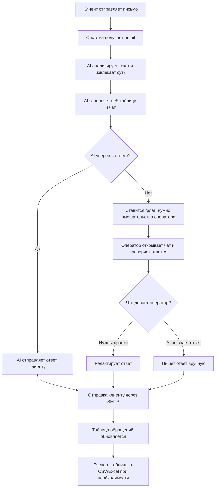

# Nandi_Enigma_Public_TestQuest

Репозиторий команды "Нанды" для хакатона Enigma (тестовое задание).

## Идейная реализация решения

Ниже описано, как мы видим архитектуру и пользовательский путь будущего решения для оператора техподдержки: от получения письма до отправки ответа и накопления базы знаний.

## Пользовательский путь (оператор техподдержки)

1. Клиент отправляет письмо на общий адрес техподдержки.
2. Сервис получения почты забирает новые письма из `INBOX` (IMAP).
3. AI-агент анализирует текст, извлекает суть проблемы, заполняет веб-таблицу для оператора, если уверен в ответе отправляет клиенту, если нет, даёт знать оператору о необходимости вмешательства.
4. В интерфейсе оператора создаётся чат с клиентом, показываются ответы AI агента, в которых он уверен/не уверен, видны "флаги" необходимости вмешательства оператора.
5. Оператор регулирует ответы AI, вмешивается там, где необходима его помощь. 
   - Нужны правки -> оператор редактирует текст -> отправка.
   - AI не знает ответ -> оператор пишет ответ вручную -> отправка.
6. После отправки письмо уходит клиенту через SMTP.
7. Кейс сохраняется в базу знаний (вопрос, итоговый ответ, метаданные, теги).
8. Таблица обращений в веб-интерфейсе обновляется (статус, время, тональность, тема и т.д.).
9. Оператор при необходимости экспортирует таблицу в CSV/Excel.

### Схема потока

## Архитектура системы

### 1) Канал получения и отправки почты
- Компонент `Email Gateway` работает с почтой по IMAP/SMTP.
- На входе: читает новые письма (тема, отправитель, дата, текст, вложения при необходимости).
- На выходе: отправляет финальный ответ клиенту от имени техподдержки.

### 2) AI-агент
- `AI Processing Service` получает текст обращения и контекст клиента.
- Выполняет классификацию запроса (тип проблемы, приоритет, тональность).
- Ищет релевантные решения в базе знаний и формирует ответ.
- Отдает в UI:
  - предложенный ответ,
  - краткое обоснование/источники,
  - степень уверенности.

### 3) База знаний
- Хранит исторические кейсы: вопрос клиента, финальный ответ оператора, теги, результат.
- Используется в двух направлениях:
  - поиск похожих кейсов,
  - накопление новых подтвержденных решений после отправки ответа.

### 4) Веб-интерфейс оператора
- Показывает входящие обращения в виде таблицы/диалога(чат).
- Позволяет:
  - открыть кейс,
  - принять ответ AI,
  - отредактировать ответ,
  - написать ответ вручную,
  - отправить ответ клиенту,
  - экспортировать список кейсов в CSV/Excel.

### 5) Таблица обращений и аналитика
- После каждого действия оператора/AI обновляется статус кейса:
  - `new` -> `drafted` -> `sent` -> `saved_to_kb`.
- Таблица хранит ключевые поля: дата, клиент, контакты, тип оборудования, тональность, суть вопроса, статус, ответ AI.
- Данные из таблицы используются для отчетности и контроля SLA.

## Взаимодействие компонентов (сквозной сценарий)

1. `Email Gateway` получает письмо и создает кейс.
2. Кейс передается в `AI Processing Service`.
3. `AI Processing Service` обращается к `Knowledge Base` за похожими решениями.
4. AI возвращает черновик ответа и атрибуты кейса.
5. `Web UI` показывает оператору таблицу с решением.
6. Оператор подтверждает/редактирует/переписывает ответ.
7. `Email Gateway` отправляет финальный ответ клиенту.
8. Финальная версия кейса сохраняется в `Knowledge Base`.
9. `Web UI` обновляет таблицу решенных вопросов и дает экспорт в CSV/Excel.

## Технологический скелет (MVP)

- `backend/` — сервисы работы с почтой и API для интерфейса.
- `front/` — веб-таблица обращений и действия оператора.
- `Knowledge Base` — на MVP может быть SQL-таблица кейсов, затем расширение до гибридного поиска (SQL + векторный индекс).
- `docker-compose.yml` — локальный запуск всех компонентов.

## Риски и меры минимизации

| Риск | меры минимизации |
|------|--------------------------|
| **Нет аутентификации пользователя** | Ввести вход в систему для операторов (логин/пароль или SSO), защитить API ключами или JWT. Ограничить CORS списком доверенных источников. |
| **Неограниченная отправка писем** | Ограничить размер и количество писем в единицу времени. |
| **Фронт и бэкенд не сходятся** | в тестовом решении не настроены свзяи, во время хакатона будет реализовано|
| **Защита от prompt injection и вредоносного текста** | Валидировать входящий текст писем перед передачей в AI; проверять и фильтровать ответ модели перед показом оператору и автоотправкой (длина, запрещённые паттерны, токсичность). Не выполнять инструкции из текста клиента как системные. |
| **В KB накапливаются персональные данные без политики и ограничений доступа** | Зафиксировать политику: что сохраняем в KB (обезличенные формулировки vs. сырой текст), срок хранения, круг лиц с доступом. По возможности хранить в KB только агрегированные/анонимизированные кейсы; доступ к полным данным — по ролям и с аудитом. |
| **При компрометации учётной записи оператора — массовый вынос данных без следов** | Ввести аудит: логировать кто, когда и какой объём данных экспортировал (CSV/Excel). Ограничить право на экспорт отдельной ролью или согласованием. Рассмотреть предупреждения и лимиты на размер/частоту экспорта. |

